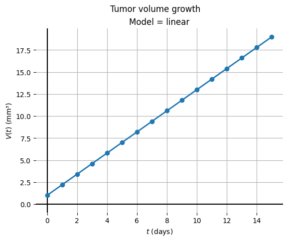

# Dynamic modelling of cancer using different growth models  

## Description  
  
- Finding the ODE that best simulates tumor growth of provided data, allowing for simulating future tumor progression
- This class uses various methods for the different steps involved:
	- ODE solvers: [Heun](https://en.wikipedia.org/wiki/Heun%27s_method), [Euler](https://en.wikipedia.org/wiki/Euler_method), [Runge-Kutta/RK4](https://en.wikipedia.org/wiki/Runge%E2%80%93Kutta_methods)
	- Optimization: [Hooke & Jeeves (pattern search)](https://en.wikipedia.org/wiki/Pattern_search_(optimization))
	- Evaluation of optimization: [Mean Squared Error (MSE)](https://en.wikipedia.org/wiki/Mean_squared_error)
	- Model comparison: [Bayes Information Criterion](https://en.wikipedia.org/wiki/Bayesian_information_criterion) (BIC), [Akaike Information Criterion](https://en.wikipedia.org/wiki/Akaike_information_criterion) (AIC), and the corrected version of AIC: AICc

## Usage
### Requirements
- Python ([3.13+](https://www.python.org/downloads/))
- [Matplotlib](https://matplotlib.org/), if the data needs to be plotted
- Dataset containing time and volume variables for tumor growth

### Installation
After installing Python, matplotlib can be installed like this:
```bash
pip install matplotlib
```

Other than this, nothing needs to be installed, you can just open up a [Jupyter Notebook](https://jupyter.org/) and import the class using:
	
```python
from cancergrowthmodel import CancerGrowthModel as cgm
```

### Usage
For extensive examples of how to use this class, please refer to [this notebook](https://github.com/YamilaTimmer/dynamic-modelling-of-cancer/blob/main/SimulatingCancerGrowth.ipynb).
## Background information
The burden cancer places on society has a large impact, due to the disease having a chronic nature and due to the treatments causing many side effects. In order to improve the efficacy of treatments and develop new ones, mathematical models (or ODE's) are being used. These help predict the tumor growth as time goes on (([Murphy et al., 2016](https://doi.org/10.1186/s12885-016-2164-x))). This Python tool is an example of a such tumor growth predictor and below we will elaborate on the ODE's and other variables used.

### ODE solvers  
  
**Euler's method**  
  
(freeCodeCamp, 2020)  
Euler's method is a first-order numerical procedure for solving Ordinary Differential Equations (ODEs) with a given initial value. It is the most elementary explicit method for the numerical integration of ODEs and also the simplest Runge-Kutta method.  
  
Euler's method is a first-order method, which means that the global error is proportional to the step size (h). Its purpose is the calculation of an unknown curve that starts at a given point and satisfies a given differential equation. Here, an ODE can be viewed as a formula by which the slope of the tangent line to the curve can be computed at any point on the curve, once the position of that point has been calculated.
  
*Method formula*  
  
$$y_{n+1} = y_n + h f(t_n, y_n)$$  
  
- $y_𝑛$ - is the y where you are currently at  
- $f(t𝑛, y𝑛)$ - is how steep the slope is on the path  
- $h$ - is the step you take  
- $y_{𝑛 +1}$ - is the new position, it takes the old position plus the distance you traveled (step size times the slope)  
  
  
**Heun's method**  
  
(_Heun’s Method Formula, Derivation & Applications With Solved Examples_, z.d.)  
This method is a simple way to find an approximate solution to ODEs when solving exactly is difficult. It is also called a predictor-corrector method because it works in two steps.  
  
First, it guesses the answer (the predictor), then improves the guess, which is called the corrector. This method finds the value of a function at the next point based on its current value and rate of change. It is known to be more accurate than Euler's method and other basic methods. Due to its use of an averaged slope, Heun’s method is a **second-order method**, which means its error decreases much faster as the step size (h) gets smaller.  
  
So how does it actually do the calculation? First, the method divides the time or interval into equal steps. At each step, it starts by estimating the slope (rate of change) using the current value. Then, it predicts a temporary value at the next step using this estimated slope.  
  
Next, it finds the second slope at this temporary value. Then, using both slopes, one from the start and the one from the prediction, it calculates a better estimate for the next point. This process will continue until the final time or value is reached.  
  
*Method formula*  
  
$$y_{n+1} = y_n + \frac{1}{2} \left[ f(t_n, y_n) + f \left( t_n + h, y_n + h \cdot f(t_n, y_n) \right) \right]$$  
  
- $y_{n+1}$ - is the approximation of the solution at time $t_n + h$  
- $y_n$ - is the approximation of the solution at time $t_n$  
- $h$ - is the step size  
- $f(t_n​,y_n​)$ - predictor slope also known as k1  
- $f(t_n​+h,y_n​+h⋅f(t_n​,y_n​))$ - corrector slope also known as k2  
  
*Note about formula*  
  
$\frac{1}{2}$ is basically $\frac{k1 + k2}{2}$, giving the average of the slopes and calculating the new, more accurate $y_{n+1}$ value.  
  
**Runge-Kutta**  
  
(_Runge Kutta 4th Order Method: Introduction, Formula, Algorithm & Example_, z.d.)  
The Runge-Kutta method is not necessarily one method but a family of numerical methods for approximating the solution of ODEs. Euler's method is technically part of this family but is better known by its own name. But the most widely known Runge-Kutta is RK4, also known as the classic Runge-Kutta method or fourth order Runge-Kutta. Here we will use the fourth order method to reference the method.  
  
The fourth order method works by estimating four different slopes (or values of the function's rate of change) at each step. These four slopes are then combined in a smart way to give a better estimate of the next value. This makes the method both accurate and easy to apply. By using just the original function, you don't need its higher derivatives.  
  
*Method formula*  
  
$$  
y_{n+1} = y_n + \frac{h}{6} (k_1 + 2k_2 + 2k_3 + k_4)  
$$  
  
Let's break this down, $k_n$ stands for each point that was calculated. Each k has its own formula too, as seen below, but for now the focus is on explaining the method formula. The formula works by taking each k and combining it to a weighted average, where the k2 and k3 weigh twice as much as the k1 and k4 points.  
  
Note for method formula:
- The entire term, $\frac{h}{6}$  the sum of the k-values, represents the change in y (dy). The $\frac{1}{6}$ calculates the weighted average slope, and then converts that slope into the vertical distance traveled.  
  
**The k formulas.**  
  
Each k-value represents an estimate of the slope per function $f(t,y)$ on a specific point within the time of $t_n$ until $t_n +1$. For this explanation, let's say we have the following differential equation to solve: $\frac{d_y}{d_t} = f(t,y)$

*formula k1*  
For this formula, Euler's method can be used to calculate the slope.  
$$k_1 = f(t_n, y_n)$$  
- $f(t𝑛, y𝑛)$ - is how steep the slope is on the path at time n and point y.  
-  $y_𝑛$ - is the y where you are currently at.  
-  $t_𝑛$ - is the current time.  
  
  
*formula k2*  
$$k_2 = f(t_n + \frac{h}{2}, y_n + \frac{h}{2}k_1)$$  
-  $y_𝑛$ - is the y where you are currently at.  
-  $t_𝑛$ - is the current time.  
- $t_n +\frac{h}{2}$ - gives the exact half of the total t. We use this to leave the start $t_n$ and use half step size instead.  
- $y_n + \frac{h}{2}k_1$ - gives us the new y value, we use our k1 to predict the new point at the current slope, if you look half a step ahead.  
- - $f(time~halfway, y~value~halfway)$ - calculates a new, better slope on the midpoint and gives result k2  
  
*formula k3*  
This formula replicates formula 2, but uses k2 to predict the new point at the current slope.  
$$k_3 = f(t_n + \frac{h}{2}, y_n + \frac{h}{2}k_2)$$  
-  $y_𝑛$ - is the y where you are currently at.  
-  $t_𝑛$ - is the current time.  
- $t_n +\frac{h}{2}$ - gives the exact half of the total t. We use this to leave the start $t_n$ and use half stepsize instead.  
- $y_n + \frac{h}{2}k_2$ - gives us the new y value, we use our k2 to predict the new point at the current slope if you look half a step ahead.  
- - $f(time~halfway, y~value~halfway)$ - calculates a new, better slope on the midpoint and gives result k3  
  
*formula k4*  
$$k_4 = f(t_n + h, y_n + hk_3)$$  
-  $y_𝑛 + hk_3$ - we use the penultimate and most accurate slope we calculated so far ($k_3$) to calculate y at the end of the step. We multiply $k_3$ by the stepsize h and add this to our start value $y_n$ to get our $k4$ value.  
-  $t_𝑛 + h$ -is the exact time where the current step ends.  
- $f(time~at~the~end, Estimated~y~value~at~the~end)$ gives the result of the estimation of the slope at the end of the step, based on earlier calculations.  
  
  
  
---  
  
## Optimization   

#### Mean Squared Error (MSE)
MSE is used as an optimization criterion, where it measures the amount of 'error'. It assesses the average squared difference between the observed and the predicted values. When there is no error, the MSE equals zero, meaning the model is perfect (almost impossible). As model errors increase, its value increases.  

MSE formula:
  
$$MSE = \frac{\sum (y_i - \hat{y}_i)^2}{n}$$
 Where:  
- $y_i$ = is the $i^{th}$ observed value  
- $\hat{y_i}$ = is the corresponding predicted value.  
- $n$ = the number of observations.  

#### Hooke & Jeeves (direct search)  
Direct search is the method that was used in this Python class to optimize the predicted parameters in order to fit the ODE onto the provided data. 

This model keeps track of the direction of travel moving from point to point, which makes the model efficient. The model first tests what way it should travel and then saves the best value as $x_1$ (this goes in one dimension only). The second step is using the vector from the old point to the new point, and we search in that direction until improvement stops. Once the parameters stop improving further in one direction, step 3 is initiated. Which repeats the first and second step. Cast about to find a better point, then travel in that direction. When the first step returns the original point as the best option, it moves on to the next step. Step four is to decrease the incremental interval, if you start with 0.1 then lower this to for example 0.01. Repeat all these steps until the interval is small enough to achieve the required tolerance ([Stanford University, z.d.](https://web.stanford.edu/group/sisl/k12/optimization/MO-unit2-pdfs/2.11minimum3D2hooke-jeeves.pdf)). 
  
**The logical formula**  
_This model uses both positive and negative probing_  
  
_Probing step_  
  
**Positive**  $$P_{new~key} = P_{current~key} + P_{delta~current~key}$$  
  
**Negative** $$P_{new~key} = P_{current~key} - P_{delta~current~key}$$  
  
The delta is to note a change, for example delta current key could be: current key * 1.2.  
  
_Step size reduction_  
  
If neither the positive nor the negative step in that dimension results in a lower MSE score, the step size will be reduced to zoom in on the current best point.  
  
$$If~No~Improvement,~then~ delta_{new~key} = 0.2~\cdot~ delta_{current~key}$$  
  
_Termination condition_  
  
To keep the loop from going forever, a stop is implemented after a certain amount of tries.  
  
$$Stop~when~max(|delta_i|) \le 10^{-9}$$ 
This means the loop will stop when the rate of chance is smaller or equal to $10^{-9}$.  

## Ordinary Differential Equations (ODE)      
This tumor growth simulation contains various types of ordinary differential equations (or ODE) that can be used to describe tumor growth over time. The models vary in complexity and realism, and each have their own use-cases. Below we elaborate further on each model.    
  
### Linear Growth model  
The linear growth model is the simplest mathematical approach to describing the tumor volume progression. The Linear models suggest that there will be a stable daily growth, which is independent of the current tumor size.  
  
Biologically, this implies that only a fixed number of cells will be created at each time point. This brings up that the linear model has a great flaw, as tumor cells start growing more when the larger they become, they only are limited by nutrition, oxygen, and blood vessels. Therefore, this model is not to be seen as accurate. (Brú, A., et al.)  
  
**The mathematical formula:**    
$$\frac{dV}{dt} = c \cdot t + V_{0}$$  
  
Where:  
- $c$ = per day growth rate.  
- $t$ = time  
- $V_0$ = initial volume  
  
The resulting slope is a straight line depicting a constant daily increase in tumor mass (sse Figure 1)  
  
  
  
*Figure 1: Linear growth model*  
  
**Model evaluation**  
The linear model has some significant limitations concerning biological fidelity, it fails to take into account the volume-dependent growth capacity and environmental limitations. However, due to its computational simplicity, it serves as a baseline function for numerical model validation and educational purposes in computational oncology.  
  
### Linear limited growth model  
The linear limited growth model addresses a key error of the linear model. It does so by introducing a volume-dependence into the growth rate ($c$). This model consists of 2 distinct growth phases: an initial phase where the growth is highly dependent on the current volume $V$, followed by a sustained linear phase when $V$ becomes large. (Brú, 2003)  
  
This also makes this model more biologically plausible because of the gradual onset of environmental constraints. The growth rate stabilizes at a constant value for larger tumors due to the increasing nutrient or oxygen limitations.  
  
  
**The mathematical formula:**   
$$ \frac{dV}{dt} = c \cdot \frac{V}{V + d} $$
Where:  
- $V(t)$ = Tumor volume (in mm3) at time t.  
- $c$ = The growth rate per time unit.  
- $d$ = volume constant that controls the transition rate between non-linear and linear phases.  
  
The resulting slope (see Figure 2) initially shows curvature but then changes towards a linear slope.  
  
  
  
**Model evaluation**  
  
This model provides a more realistic, volume-dependent initial growth that is more biologically accurate. However, despite the introduction of a transition between states, the model still does not incorporate a carrying capacity. Meaning it will go on forever, and is not good at modeling the life cycle of tumors that will eventually stabilize due to the environmental factors.  
  
---  
  
### Exponential model    
The exponential growth model is based on the assumption that the rate of cell rapid reproduction is directly proportional to the current number of rapidly reproducing cells. These are in turn proportional to the tumor volume V. It implies that the cell doubling time remains constant over the growth period, and there are no (environmental-) resource limits. Biologically, this model is good at simulating early-stage tumor growth, which is the phase where a lot of resources like oxygen and nutrients are available. Gerlee, P. (2013).   
  
**The mathematical formula:**   
$$\frac{dV}{dt} = V + c \cdot V$$   
Where:  
- $V$ = volume of tumor at time t.  
- $c * V$ = growth rate times the Volume at t.  
  
The resulting slope continues to get steeper and higher after each time point, this can be seen in figure 3.  

  
  
  
*Figure 2: Exponential model*  
  
  
**Model evaluation**  
  
The model, like said earlier, is accurate and effective for modeling early-stage tumors that have a resource-rich environment.  However, the critical flaw in this model is its assumption of perpetual, unrestricted growth. This is biologically unsustainable. As when a tumor matures, the increasing need for nutrients and oxygen plus their unavailability, keeps it from growing. Besides resources, cellular loss (apoptosis) and other factors cause effective growth to decline. This makes the exponential model unsuitable for long-term periods. Gerlee, P. (2013).   
  
### Exponential flattening model    
The exponential flattening model takes the assumption that a tumor can not keep growing indefinitely. This is true as there are environmental challenges that arise when a tumor reaches a certain volume. In an organism, there will always be a maximum volume for the tumor, which depends on factors such as the tumor's access to resources and to "free" space to grow in [(Murphy et al., 2016)](https://doi.org/10.1186/s12885-016-2164-x). The exponential flattening model does keep this limitation in mind, and the tumor growth per time unit is described as:  
  
**The mathematical formula:**   
  
$$\frac{dV}{dt} = V + c \cdot V \cdot (1.0 - V/V_{max})$$   
Where:  
- $V$ = Volume at time t  
- $c$ = the growth rate per t  
- $V_{max}$ = the maximum stable volume the tumor can become.  
- $(1.0 - \frac{V}{V_max})$ = the braking factor, when the tumor enters its late stage, this will result in being 0.  
  
In this slope, the increase in volume is determined by how close the tumor is to reaching its maximum volume, the closer it gets to this threshold, the slower the growth.  
  
  
  
*Figure 3: Exponential flattening model*  
  
**Model evaluation**  
  
The model is biologically more accurate than the previous models, it is the first to take the concept of carrying capacity into consideration. It does however, assume that the growth rate will be immediately suppressed based on its current volume, it does not take into account the time required for cells to enter apoptosis or necrosis.  
  
---  
### Mendelsohn Growth   
  
The Mendelsohn Growth model assumes that growth is unlimited, this is in contrast to the previous exponential flattening model (Bindhammer, n.d.). It implies that a tumor cell could replicate and grow bigger, and negates the limits the body has. The biology however, tells us this cannot be true, due to the fact of environmental limitations and size limitations. (Gerlee, 2013)   
  
  
**The mathematical formula:**   
 $$\frac{dV}{dt} = c \cdot V^{d}$$   
   
Where:  
  
- $c$ = the tumor growth rate   
- $V^d$ = Volume to the power of d (The allometric factor).   
- $d$ = strength of volume limiter.  
  
This generates the slope seen in Figure 4, it looks like an exponential growth slope.  
Note that this might not be accurate as the slope depends on the d - allometric factor.  
  
  
  
*Figure 4: Mendelsohn Growth model*  
  
**Model evaluation**  
  
The $d$ allometric factor gives flexibility, and it can be optimized for the different tumor phases. This makes the model better than the standard exponential and linear models.
The limitations, however come to the fact that $d$ will never truly reach 0, therefore there will always be growth.   

--- 
### Von Bertalanffy Model    
This ODE takes into account growth in relation to surface area (surface rule model), which states cell growth should be proportional to its surface area [(Chan et al., 2023)](https://doi.org/10.47611/jsrhs.v12i4.5202). The model assumes that the net growth rate does not only consist of tumor cell proliferation but also of tumor cell death [(Botmann & Dobrovolny, 2025)](https://doi.org/10.3389/fams.2025.1542617). In order to apply this, in the equation, volume is raised to 2/3. The bigger the surface area, the higher the amount of nutrients/energy for the cells to absorb, and the faster the tumor will grow.     
    
This model has been successfully implemented to predict tumor growth in literature, e.g. by [Heesterman et al. (2018)](https://doi.org/10.1055/s-0038-1667148  ).  
  
**The mathematical formula**  
  
$$\frac{dV}{dt} = c \cdot V^{\frac{2}{3}} - d \cdot V$$
Where:  
- $c$ = growth factor  
- $V^{\frac{2}{3}}$ = represents the surface scaling area  
- $d$ = The braking factor that implements cell death  
  
The slope it creates can be seen in figure 5:  
  
  
  
_Figure 5: the mertalanffy model._  
  
**Model evaluation**  
  
The model is biologically accurate, because of two reasons: 1 the max cells allowed on a certain surface area and 2 the braking factor taking into account apoptosis and necrosis. The 2/3 split might not be accurate for every tumor type, however and this is the model's downfall.  
  
---    
    
### Gompertz model  
The Gompertz model was originally made to predict human mortality curves, but turned out to be a very suitable model to predict cancer growth, as it seems to provide the best predictions for e.g. breast and lung cancer growth [(Murphy et al., 2016)](https://doi.org/10.1186/s12885-016-2164-x). This model takes into account growth velocity, or the change of weight/height over time which is useful for monitoring growth [(Zanotti & Faria, 2025)](https://doi.org/10.56238/edimpacto2025.041-005).     
    
The difference between the Gompertz and Logistic models is the mechanism of growth reduction. Gompertz assumes that growth rate decreases linearly with the log of the volume.  
This mechanism shows the biological reality that growth stagnates and decelerates when resources become limited.  
  
**The mathematical formula**  
  
$$\frac{dV}{dt} = c \cdot V \cdot \ln\Big(\frac{V_{max}}{V}\Big)$$
Where:  
  
- $c$ = the specific growth rate per t   
- $V_{max}$ = the maximum achievable volume also known as the Carrying Capacity.  
- $ln({\frac{V_{max}}{V}})$ = a natural logarithmic braking factor which drives the growth rate to zero when V approaches $V_{max}$  
  
The slope created can be seen in Figure 6:  
  
  
  
_Figure 6: The gompertz model_  
  
**Model evaluation**  
  
Widely used model in oncology  Bindhammer, M. (n.d.) so tried and tested. Also complex and hard to solve mathematically so could be difficult for beginners.  
  
---  
### Logistic Growth   
The exponential growth model has some limitations in predicting the long-term growth rate of cancer cell proliferation ([Tabassum et al., 2019](https://doi.org/10.1088/1742-6596/1366/1/012018)). For this reason the logistic model was introduced. It better explains the behavior of cancer in a later stage.

**The mathematical formula**  
  
$$\frac{dV}{dt} = c \cdot (V_{max} - V)$$
Where:  
- $c$ = Growth rate per t  
- $(V_{max} - V)$ = braking rate that slows the growth of the tumor as it approaches max size  
  
The max tumor volume occurs due to the lack of blood vessels and nutrients to sustain the tumor ([Chan et al., 2023](https://doi.org/10.47611/jsrhs.v12i4.5202)).   
  
  
  
_Figure 7: Logistic growth model_  

---
### Montroll growth model    
A model that says tumors can grow quickly when there are nutrients, space, and blood vessels, but the growth will slow when these resources become scarce (Rodrigues, 2024)(Goel et al., 1971).  
It will look like a log function, because the growth will quickly rise and then level out.   
  
  
**The mathematical formula**   
$$\frac{dV}{dt} = c \cdot V \cdot \left({V^d_{\text{max}} - V ^ d}\right)$$  
  
Where:  
- $V$ = Current volume  
- $t$ = time  
- $c$ = growth rate  
- $d$ = The braking factor that implements cell death  
- $\left({V^d_{\text{max}} - V ^ d}\right)$ = remaining capacity of the growth rate,   
early stage $V$ is very small meaning high growth rate, later stage V approaches $V_{max}$ the growth rate slows down,  
V =  $V_{max}$ and the growth rate turns to 0 because the maximum stable size was reached.  
  
  
The graph will look like this:  
  
  
  
_Figure 8: Montroll growth model_  
  
**Model evaluation**  
  
This model allows d to vary, therefore it encompasses the standard logistic and Gompetrz models. Doing this is can accurately model the growth of tumors that don't follow a perfect symmetric or early deceleration pattern. The model is quite complex however and would need some proper research to be understandable and applied correctly.  
  
---  
### Allee Effect  
Models in tumor growth often assume exponential growth kinetics at low cell population. In recent pre & clinical observations of tumor initiation or recurrence indicate the presence of tumor growth kinetics in which growth rates scale positively with cell numbers.  
Recent observations however suggest a cooperative growth pattern also known as the allee effect. Here growth rates increase with cell numbers at low densities (Johnson et al., 2019).  
  
**The mathematical formula**  
  
$$\frac{dV}{dt} = c \cdot (V - V_{min}) \cdot (V_{max} - V)$$  
  
Where:  
  
- V = current tumor volume  
- $V_{min}$ = Allee Threshold (the minimum required amount of cells for the tumor to grow)  
- $V_{max}$ = The maximum tumor volume also known as carrying capacity  
- $c$ = growth rate.  
  
This will result in a graph like in Figure 9  
  
  
  
_Figure 9: Allee effect model_  
  
  
**Model evaluation**  
  
This model is highly realistic for the initial growth phases, and it's implementation of having a maximum tumor size meaning apoptosis necrosis and environmental have been accounted for. However, $V_{min}$ is difficult to measure clinically so the accuracy and reproducibility might suffer.  
  
---  
  
  
### Surface limited growth model  
This model states that when an essential nutrient of any kind gets limited, the growth rate of an individual cell will be proportional to its surface area rather than to its volume. The decrease in dimensionality from volume to surface is expected to favor the smaller cells. The model deals with cell growth under unusual nutritional conditions, and the predictions on how cell replication cycle is assumed to behave when there is unusual nutritional conditions (Grover, 1988).   
  
**The mathematical formula**  
  
$$\frac{dV}{dt} = c \cdot \frac{V}{(V + d)^{1/3}}$$
Where:  
- $c$ = growth rate.  
- $V$ = current cell volume.  
- $\frac{V}{(V + d)^{1/3}}$ = the effective cell surface that is available for tumor growth.  
- $d$ = A baseline constant - vragen aan dave  
  
  
  
  
_Figure 10: Surface limited growth model_  
  
**Model evaluation**  
  
This model favors small cells because of the free surface and the surface getting less full less fast. It takes into account that nutrients need to be distributed  
across the cell surface. The down side is that it assumes that only surface is a limiting factor and in reality there are multiple things that can be a limiting factor.  
  
### Authors    
---  
- [Yamila Timmer](https://github.com/YamilaTimmer)  
- [Jarno Duiker](https://github.com/azzipxonraj)   
  
# Sources    
- Murphy, H., Jaafari, H., & Dobrovolny, H. M. (2016). Differences in predictions of ODE models of tumor growth: a cautionary example. _BMC Cancer_, _16_(1), 163. https://doi.org/10.1186/s12885-016-2164-x  
- Tabassum, S., Rosli, N. B., & Binti Mazalan, M. S. A. (2019). Mathematical Modeling of Cancer Growth Process: A Review. *Journal of Physics: Conference Series, 1366*(1), 012018. https://doi.org/10.1088/1742-6596/1366/1/012018
- Chan, K., Kao, C., Gordinier, J., & Ganden, K. (2023). Treatment Optimization for Tumor Growth by Ordinary Differential Equations. _Journal Of Student Research_, _12_(4). https://doi.org/10.47611/jsrhs.v12i4.5202  
- Stanford University. (z.d.). _Minimizing in 3D: Method 3 Hooke-Jeeves_. https://web.stanford.edu/group/sisl/k12/optimization/MO-unit2-pdfs/2.11minimum3D2hooke-jeeves.pdf
- Heesterman, B., Bokhorst, J., De Pont, L., Verbist, B., Bayley, J., Van Der Mey, A., Corssmit, E., Hes, F., Van Benthem, P., & Jansen, J. (2018). Mathematical Models for Tumor Growth and the Reduction of Overtreatment. _Journal Of Neurological Surgery Part B Skull Base_, _80_(01), 072–078. https://doi.org/10.1055/s-0038-1667148  
- Botmann, N. K. G., & Dobrovolny, H. M. (2025). Assessing the role of model choice in parameter identifiability of cancer treatment efficacy. _Frontiers in Applied Mathematics And Statistics_, _11_. https://doi.org/10.3389/fams.2025.1542617  
- Zanotti, Y. P., & Faria, H. A. M. (2025). CLASSICAL MATHEMATICAL MODELS OF POPULATION GROWTH FOR PREDICTING CELL CULTURE IN BIOREACTORS. In _Seven Editora eBooks_. https://doi.org/10.56238/edimpacto2025.041-005  
- Gerlee, P. (2013). The Model Muddle: In Search of Tumor Growth Laws. _Cancer Research_, _73_(8), 2407–2411. https://doi.org/10.1158/0008-5472.can-12-4355  
- Bindhammer, M. (n.d.). From the Mendelsohn model to the Gompertz and logistic growth law.  
- Talkington, A., & Durrett, R. (2015). Estimating Tumor Growth Rates In Vivo. Bulletin of Mathematical Biology, 77(10), 1934–1954. https://doi.org/10.1007/s11538-015-0110-8  
- Johnson, K. E., Howard, G., Mo, W., Strasser, M. K., Lima, E. A. B. F., Huang, S., & Brock, A. (2019). Cancer cell population growth kinetics at low densities deviate from the exponential growth model and suggest an Allee effect. PLoS Biology, 17(8), e3000399. https://doi.org/10.1371/journal.pbio.3000399  
- Rodrigues, J. A. (2024). Using Physics-Informed Neural Networks (PINNs) for Tumor Cell Growth Modeling. Mathematics, 12(8), 1195. https://doi.org/10.3390/math12081195  
- Goel, N. S., Maitra, S. C., & Montroll, E. W. (1971). On the Volterra and Other Nonlinear Models of Interacting Populations. Reviews Of Modern Physics, 43(2), 231–276. https://doi.org/10.1103/revmodphys.43.231  
- Grover, N. (1988). Surface-limited growth: A model for the synchronization of a growing bacterial culture through periodic starvation. Journal Of Theoretical Biology, 134(1), 77–87. https://doi.org/10.1016/s0022-5193(88)80303-5  
- Heun’s Method Formula, Derivation & Applications with Solved Examples_. (z.d.). Testbook. https://testbook.com/maths/heuns-method  
- freeCodeCamp. (2020, 26 januari). _Euler's Method Explained with Examples_. freeCodeCamp.org. https://www.freecodecamp.org/news/eulers-method-explained-with-examples/  
- Runge Kutta 4th Order Method: Introduction, Formula, Algorithm & Example_. (z.d.). Testbook. https://testbook.com/maths/runge-kutta-4th-order  
- Brú, A., Albertos, S., Luis Subiza, J., García-Asenjo, J. L., & Brú, I. (2003). The universal dynamics of tumor growth. Biophysical journal, 85(5), 2948–2961. https://doi.org/10.1016/S0006-3495(03)74715-8  
- Wikipedia contributors. (2025, 27 oktober). Monte Carlo method. Wikipedia. https://en.wikipedia.org/wiki/Monte_Carlo_method  
- Ibm. (2025, 17 november). Monte Carlo Simulation. IBM. https://www.ibm.com/think/topics/monte-carlo-simulation  
- GeeksforGeeks. (2025, 12 november). Monte Carlo Tree Search (MCTS) in machine learning. GeeksforGeeks. https://www.geeksforgeeks.org/machine-learning/monte-carlo-tree-search-mcts-in-machine-learning/  
